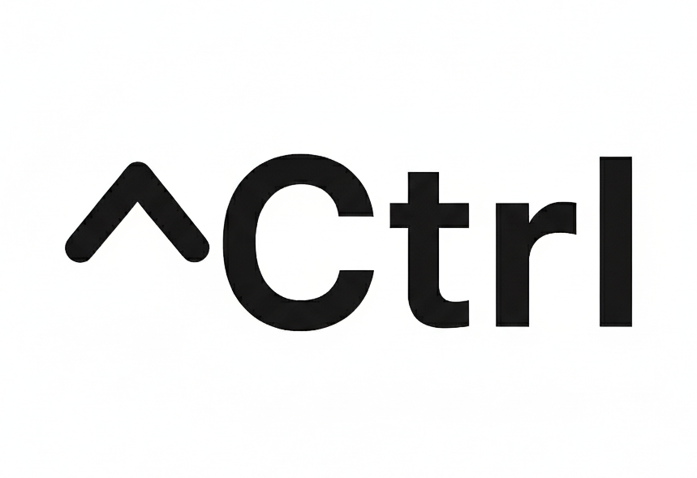

  <br/>
  <p align="center">
    
  </p>

Ctrl is a package that allows you to control observables within scopes that are linked to the Widget Lifecycle.

It provides a simple way to manage state in your Flutter applications using Flutter's built-in ChangeNotifier.

## Features

-   **Observables**: Reactive data holders that notify listeners when their value changes.
-   **Scopes**: A mechanism to manage the lifecycle of your observables.
-   **Lifecycle Linkage**: Automatically initializes and disposes of your scopes and observables when the Widget is created and destroyed.
-   **Pattern Agnostic**: Does not force you to use a specific architecture.

## Deep Dive: Observable

`Observable` is the core of this package. It is an enhanced version of Flutter's `ChangeNotifier` that provides more power and flexibility.

Unlike a standard `ChangeNotifier`, an `Observable`:
-   Holds a value and by default notifies listeners only when the value changes(You can use emitAll to notify listeners even if the value hasn't changed).
-   Allows you to define custom equality logic via `changeDetector`.
-   Can be granularly forced to notify listeners even if the value hasn't changed using `reload()`.

### Advanced Features

The package comes with a set of useful extensions to manipulate your data, like:

-   **transform**: Creates a new observable that is derived from the original one. It updates automatically when the source changes.
-   **mirror**: Creates a read-only view of a mutable observable.
-   **hotswappable**: Allows you to dynamically switch the underlying source of the observable.
-   **filtered**: (For Lists) Creates a new observable list that only contains elements that satisfy a condition.
-   **notNull**: (For Lists) Creates a new observable list with all null values removed.

## Deep Dive: Scopes

Scopes are used to manage the lifecycle of your observables. They are automatically initialized and disposed of when the Widget is created and destroyed.

Observables have an internal scope. Dependent observables like transformed, inherit the scope of their source. So when the source is disposed, the dependent observables are disposed as well.

## Installation

Add `ctrl` to your `pubspec.yaml`:

```yaml
dependencies:
  ctrl: ^1.0.0
```

## Usage

### 1. Create a Ctrl class (Controller / ViewModel / Store)

Use the `Ctrl` mixin to add scope management capabilities to your class. You can create observables using the `mutable` method.

```dart
import 'package:ctrl/ctrl.dart';

class CounterController with Ctrl {
  // Create a mutable observable
  late final count = mutable(0);

  // Create a derived observable
  late final doubleCount = count.transform((data) => data.value * 2);

  void increment() {
    count.value++;
  }
}
```

### 2. Connect to a Widget

You can use `ViewWidget` or `ViewState` to connect your Ctrl class to the widget lifecycle.

#### Using ViewWidget

`ViewWidget` is perfect for simple widgets. It handles the creation and disposal of the Ctrl class for you.

You can access your 'Ctrl class' using the `ctrl` property. This property is an accessor that points to the instance of your Ctrl class.

```dart
import 'package:flutter/material.dart';
import 'package:ctrl/ctrl.dart';

class CounterPage extends ViewWidget<CounterController> {
  const CounterPage({super.key});

  @override
  Widget build(BuildContext context, CounterController ctrl) {
    // You can rename 'ctrl' to whatever you want, e.g., 'viewModel' or 'store'
    return Scaffold(
      appBar: AppBar(title: const Text('Counter')),
      body: Center(
        // Watch the observable for changes
        child: Column(
          mainAxisAlignment: MainAxisAlignment.center,
          children: [
            Watch(
              ctrl.count,
              builder: (context, value) => Text('Count: $value'),
            ),
            Watch(
              ctrl.doubleCount,
              builder: (context, value) => Text('Double: $value'),
            ),
          ],
        ),
      ),
      floatingActionButton: FloatingActionButton(
        onPressed: ctrl.increment,
        child: const Icon(Icons.add),
      ),
    );
  }
}
```

#### Using ViewState

For more complex scenarios where you need full access to the `State` lifecycle, use `ViewState`.

```dart
import 'package:flutter/material.dart';
import 'package:ctrl/ctrl.dart';

class CounterPage extends StatefulWidget {
  const CounterPage({super.key});

  @override
  State<CounterPage> createState() => _CounterPageState();
}

class _CounterPageState extends ViewState<CounterController, CounterPage> {
  @override
  Widget build(BuildContext context) {
    return Scaffold(
      appBar: AppBar(title: const Text('Counter')),
      body: Center(
        child: Watch(
          ctrl.count,
          builder: (context, value) => Text('Count: $value'),
        ),
      ),
      floatingActionButton: FloatingActionButton(
        onPressed: ctrl.increment,
        child: const Icon(Icons.add),
      ),
    );
  }
}
```

### Dependency Injection

By default, `Ctrl` uses a simple built-in service locator. You can register your controllers before using them.

```dart
void main() {
  // Register the controller factory
  Locator().registerFactory(() => CounterController());
  
  runApp(const MyApp());
}
```

You can also override `resolveCtrl` in your `ViewWidget` or `ViewState` to use any other dependency injection solution (like GetIt, Provider, etc.).

```dart
@override
CounterController resolveCtrl(BuildContext context) => GetIt.I.get<CounterController>();

```
